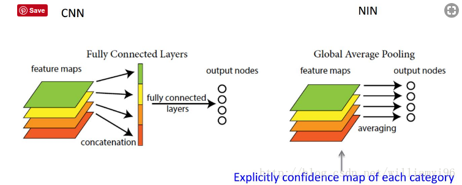

## 1. FCN和GAP的区别  

全卷积层替换全连接层并不能减少参数。假设上层特征图为256*7*7，全连接层为4096，则参数个数应该是7*7*256*4096.替换成全卷积层之后，卷积核大小为7*7*256，输出为4096*1*1，所以参数个数为7*7*256*4096。并没有减少参数个数，详情可参见：全连接层的作用是什么？ - 魏秀参的回答 - https://www.zhihu.com/question/41037974/answer/150522307--2018.4.27更新--要想起到参数减少需要一个global average pooling的过程，而相应的卷积操作并不是全卷积。  

  

