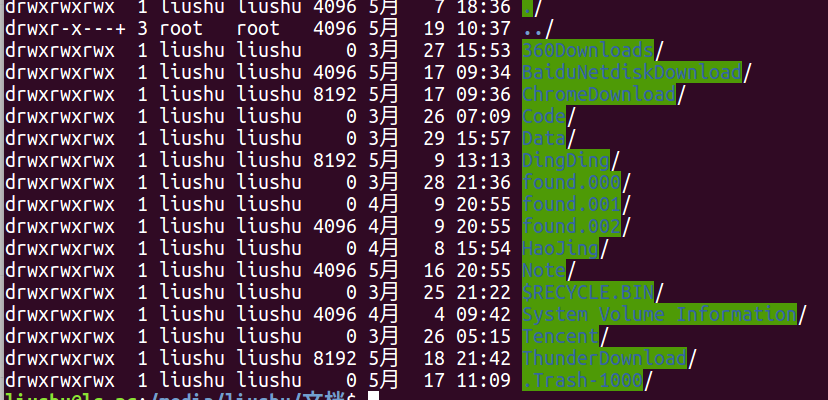

## 1. 基本
### 1.1 root
  输入关键词：密码   

    sudo passwd root

### 1.2 换源
  修改  
  
    cd /etc/apt
    vim source.list

### 1.3 Unable to access “文档”
    sudo ntfsfix /dev/sda5

### 1.4 配置环境变量
  1.4.1 ~/.bashrc  
  生效时间：使用相同的用户打开新的终端时生效，或者手动source ~/.bashrc生效  
  生效期限：永久有效  
  生效范围：仅对当前用户有效  

    vim ~/.bashrc
    # 在最后一行加上
    export PATH=$PATH:/home/uusama/mysql/bin	

  1.4.2 ~/.bash_profile  
  生效时间：远程登录时生效，或者手动source ~/.bash_profile生效  
  生效期限：永久有效  
  生效范围：仅对当前用户有效  

    vim ~/.bash_profile
    # 在最后一行加上
    export PATH=$PATH:/home/uusama/mysql/bin

  1.4.3 /etc/bashrc, /etc/profile, /etc/environment  
  生效时间：新开终端生效，或者手动source /etc/bashrc生效  
  生效期限：永久有效  
  生效范围：对所有用户有效  

## 2. 五笔输入法安装
  1> sudo apt-get install fcitx-table-wubi，重启  
  2> Ubuntu16.04在System Setting->Language Support中(Ubuntu18.04 Setting)，最下面Keyboard input method system，由ibus切换成fcitx(18.04和20.04不需要，还是ibus)  
  3> 在桌面最右上角，点击输入法->Text Entry Setting...->添加wubi 和 pinyin (18.04是“汉语”点进去，不需要进行修改) 
  4> 繁体简体切换：shift + ctrl + f
  5> 18.04的比例缩放问题输入以下命令：  
  
      gsettings set org.gnome.desktop.interface text-scaling-factor 1.3
      ls-pc$ vi ~/.bashrc 
      export GIO_EXTRA_MODULES=/usr/lib/x86_64-linux-gnu/gio/modules/ 

## 3. 不自动隐藏菜单栏
  SystemSetting->Appearance->Behavior, 选In the menu bar和Always displayed

## 4. 修复安装
    sudo apt -f install

## 5. win与Ubuntu系统时间不一致
    sudo  timedatectl set-local-rtc true

## 6. 温度监控
    sudo apt-get install lm-sensors hddtemp
    sudo sensors-detect
    sensors
    sudo apt-get install psensor
  在Psensor中设置开机启动
  在Sensor Preferences中设置显示项 Application indicator Display sensor in the label

## 7. 实时查看gpu占用率
  watch -n 10 nvidia-smi
  
## 8. commond >out.txt 2>&1
0:标准输入, 1: 标准输出, 2:标准错误输出
将标准错误输出 重定向到 标准输出中,&的作用是使1不是文件名,而是标准输出1

## 9. 暂停在终端命令行运行的程序
    $ Ctrl + Z 暂停运行
    $ fg # 拉到前台继续运行
    $ bg # 挂到后台运行
    
## 10. 软硬鏈接
### 1. 软链接
    $ ln -s aaa bbbb
可以理解为把aaa文件夹创建了一个名字为bbb的快捷方式
### 2. 硬链接
    $ ln aaa bbb
可以理解为硬盘上有两个相同的文件夹或文件，他们之间的内容是实时同步的，實際只是添加將aaa作爲了一個node，指向和bbb一樣的物理地址？

## 11. 全绿色背景文件
全绿色高亮背景，如图  

  

  
含义: 文件夹的权限全部开放，比如777, 可用chmod改变

## 12. 查看当前文件夹占用空间
du : Disk usage  
-s或--summarize  仅显示总计，只列出最后加总的值。  
-h或--human-readable  以K，M，G为单位，提高信息的可读性。  

    $ du -hs
    35G     .

查看第一级目录，以G为单位

    du -B G --max-depth=1 /home/DATA/DATASET/

## 13. 关闭标签
ctrl + d

## 14. 修改密码
passwd xxx

## 15. pip换源
修改 ~/.pip/pip.conf (没有就创建一个)， 内容如下：

    [global]
    trusted-host=mirrors.aliyun.com
    index-url=http://mirrors.aliyun.com/pypi/simple/

### 15.1 问题
".pip/pip.conf" E212: Can't open file for writing  
因为不存在.pip这个文件夹所以会存在这个问题，新建文件夹~/.pip可以解决

### 15.2 pip国内的一些镜像
    阿里云 http://mirrors.aliyun.com/pypi/simple/ 
    中国科技大学 https://pypi.mirrors.ustc.edu.cn/simple/ 
    豆瓣(douban) http://pypi.douban.com/simple/ 
    清华大学 https://pypi.tuna.tsinghua.edu.cn/simple/ 
    中国科学技术大学 http://pypi.mirrors.ustc.edu.cn/simple/    

## 16. 查看文件数量
1. 查看当前目录下的文件数量（不包含子目录中的文件）

    ls -l|grep "^-"| wc -l
2. 简写输出第一个

    l|wc

## 17. 删除指定类型文件
    find . -name '*.exe' -type f -print -exec rm -rf {} \;
(1) "."    表示从当前目录开始递归查找  
(2) “ -name '*.exe' "根据名称来查找，要查找所有以.exe结尾的文件夹或者文件  
(3) " -type f "查找的类型为文件  
(4) "-print" 输出查找的文件目录名  
(5) 最主要的是是-exec了，-exec选项后边跟着一个所要执行的命令，表示将find出来的文件或目录执行该命令。  
     exec选项后面跟随着所要执行的命令或脚本，然后是一对儿{}，一个空格和一个\，最后是一个分号  

## 18. vi多行注释
使用vi批量加注释“#”，看似简单但用处很大。  
1、ctrl+v使用方向键上下选择范围；  
2、shift+i进入编辑模式，添加“#”，此时只会在选中行的第一行添加“#”，随后按esc退出(也可能是按两次，可理解为运行批量添加）；此时选中全部行的批注已加好  
3、删批注：ctrl+v使用方向键上下选择去除批注的范围，按“x”；  

## 19. 查看内存使用
free

    -b 　以Byte为单位显示内存使用情况。 
    -k 　以KB为单位显示内存使用情况。 
    -m 　以MB为单位显示内存使用情况。
    -g   以GB为单位显示内存使用情况。 
    -o 　不显示缓冲区调节列。 
    -s<间隔秒数> 　持续观察内存使用状况。 注意，有些版本要先在前面设置次数，如：‘-c 3’
    -t 　显示内存总和列。 
    -V 　显示版本信息。 
    -h, --human         show human-readable output
    
示例：

    liushu@host111:~$:free -h -c 3 -s 1
                  total        used        free      shared  buff/cache   available
    Mem:            31G        7.8G         13G        629M        9.9G         22G
    Swap:           31G        1.8G         30G

                  total        used        free      shared  buff/cache   available
    Mem:            31G        7.8G         13G        629M        9.9G         22G
    Swap:           31G        1.8G         30G

                  total        used        free      shared  buff/cache   available
    Mem:            31G        7.8G         13G        629M        9.9G         22G
    Swap:           31G        1.8G         30G

## 20. 查看pid对应的用户调用信息
    ps -f -p 1234
    -f  Do full-format listing. 
    -p  pidlist

## 21. linux之间复制文件 scp
Linux scp命令用于Linux之间复制文件和目录。  
scp是 secure copy的缩写, scp是linux系统下基于ssh登陆进行安全的远程文件拷贝命令。
### 21.1 从本地复制到远程
    # 文件
    scp local_file remote_username@remote_ip:remote_file 
    # 文件夹
    scp -r local_folder remote_username@remote_ip:remote_folder 
### 21.2 从远程复制到本地
    scp root@www.runoob.com:/home/root/others/music /home/space/music/1.mp3 
    scp -r www.runoob.com:/home/root/others/ /home/space/music/
### 21.3 说明
如果远程服务器防火墙有为scp命令设置了指定的端口，我们需要使用 -P 参数来设置命令的端口号，命令格式如下：  

    #scp 命令使用端口号 4588
    scp -P 4588 remote@www.runoob.com:/usr/local/sin.sh /home/administrator

## 22. Ubuntu快捷方式
    #!/usr/bin/env xdg-open
    [Desktop Entry]
    Name=微信
    Comment=Unofficial WeChat client built with React, MobX and Electron.
    Exec="/opt/wewechat/wewechat" %U
    Terminal=false
    Type=Application
    Icon=wewechat(可以是绝对路径)
    Categories=Chat;
    
## 23. ffmpeg
### 23.1 截取视频
    # 截取视频的前10秒钟，-ss: 开始时间， -t: 截取视频时间
    ffmpeg -ss 0:0 -t 0:10 -i input.mov output.mp4
### 23.2 截取图像
    # 输入的视频
    ffmpeg -i test.mp4 %05d.jpg
### 23.3 修改视频大小
    ffmpeg -i  input.mp4 -s 320:240 output.mp4
    
    
## 24. 批量kill某个进程
如kill多进程，一个个去手动kill太麻烦

    ps -aux |grep 'python test.py'|cut -c 9-15|xargs kill -9
    
“cut -c 9-15”是截取输入行的第9个字符到第15个字符，而这正好是进程号PID。    
“xargs kill -s 9”中的xargs命令是用来把前面命令的输出结果（PID）作为“kill -s 9”命令的参数，并执行该命令。“e69da5e887aa7a6431333365656531kill -s 9”会强行杀掉指定进程。   

## 26. Ubuntu更新chrome
    wget https://dl.google.com/linux/direct/google-chrome-stable_current_amd64.deb
    sudo dpkg -i ./google-chrome-stable_current_amd64.deb

## 27. Ubuntu默认内核修改
    $sudo vim /etc/default/grub
    #GRUB_DEFAULT=0
    GRUB_DEFAULT="1>2"
    $sudo update-grub

## 28. 字体
https://blog.csdn.net/starzhou/article/details/105493420
    //解压压缩包
    tar -zxvf YaHeiConsolas.tar.gz

    //在系统目录下创建自定义字体目录
    sudo mkdir -p /usr/share/fonts/vista

    //复制解压出来的字体到刚才创建的目录
    sudo cp YaHeiConsolas.ttf /usr/share/fonts/vista/

    //修改字体权限
    sudo chmod 644 /usr/share/fonts/vista/*.ttf
    //进入字体目录
    cd /usr/share/fonts/vista/
    //刷新并安装字体
    sudo mkfontscale && sudo mkfontdir && sudo fc-cache -fv

     vscode setting.json "YaHei Consolas Hybrid'"

## 29. 显示网速

    sudo add-apt-repository ppa:fossfreedom/indicator-sysmonitor
    sudo apt install indicator-sysmonitor
    indicator-sysmonitor
    # 在右上角上点击，出现preferences
    # 在General中点击Run on startup
    # 在Advanced中点击Advanced,写入
    # cpu: {cpu} mem: {mem} net:{net}

## 30. install pytorch
    conda install pytorch==1.2.0 torchvision==0.4.0 cudatoolkit=10.0 -c pytorch -y

## 31. 有道
    https://github.com/ChestnutHeng/Wudao-dict
    
## 32. vsftpd
    $sudo apt install vsftpd   
    $sudo vim /etc/vsftpd.conf

    chroot_local_user=YES
    local_root=/home/liushu/Documents/FTP
    allow_writeable_chroot=YES
    write_enable=YES

## 33. 禁止ubuntu内核更新
    sudo dpkg  --get-selections | grep linux-image
    sudo apt-mark hold linux-image-generic linux-headers-generic 

## 34. 在目录下查找文件中包含特定内容的位置
注意：find ./ -name '这里要加引号'  

    grep 'ganmei' `find ./ -name '*.py'`

## 35. tar加密解密
    加密压缩
    tar -czvf - file | openssl des3 -salt -k passw0rd -out /path/to/file.tar.gz

    解密解压
    openssl des3 -d -k passw0rd -salt -in /path/to/file.tar.gz | tar xvf -

## 36. 创建用户
    sudo useradd -r -m -s /bin/bash 用户名
  注：   
  1、在Ubuntu18.04系统中，不会在创建用户的时候自动提示设置密码。需要手动执行：sudo passwd dongyuanxin_2016150127命令来设置新用户的密码。  
  2、上面命令的参数意义如下：  
  -r：建立系统账号  
  -m：自动建立用户的登入目录  
  -s：指定用户登入后所使用的shell
  
    # 设置密码
    passwd 用户名

这里采用修改Ubuntu 18.04系统/etc/sudoers文件的方法分配用户权限。因为此文件只有r权限，在改动前需要增加w权限，改动后，再去掉w权限。

    sudo chmod +w /etc/sudoers
    sudo vim /etc/sudoers

添加下图的配置语句，并且保存修改

    #User privilege specification
    root　ALL=(ALL:ALL) ALL
    # 添加下面一行
    user ALL=(ALL:ALL) ALL
    
    sudo chmod -w /etc/sudoers

对于root用户，他的umask值是022。当root用户创建目录时，默认的权限就是用最大权限777去掉相应位置的umask值权限，即对于所有者不必去掉任何权限，对于所属组要去掉w权限，对于其他用户也要去掉w权限，所以目录的默认权限就是755；当root用户创建文件时，默认的权限则是用最大权限666去掉相应位置的umask值，即文件的默认权限是644。

    umask 0007
    
其他人没有read, write, exe的

## 37. cloc
使用cloc来统计代码量

    221 text files.
    220 unique files.                                          
    32 files ignored.

    github.com/AlDanial/cloc v 1.82  T=0.10 s (1970.6 files/s, 434965.0 lines/s)
    -------------------------------------------------------------------------------
    Language                     files          blank        comment           code
    -------------------------------------------------------------------------------
    C++                             67           3796           4514          15596
    C/C++ Header                    92           2614           4863           7868
    CMake                            9            151            207            856
    YAML                            16            226            331            506
    Markdown                         2             93              0            192
    JSON                             2              0              0             42
    C                                1              7             25             32
    XML                              1              7              0             12
    -------------------------------------------------------------------------------
    SUM:                           190           6894           9940          25104
    -------------------------------------------------------------------------------

blank: 空行数  
comment: 注释行数，如'//'  
code: 代码行数  

